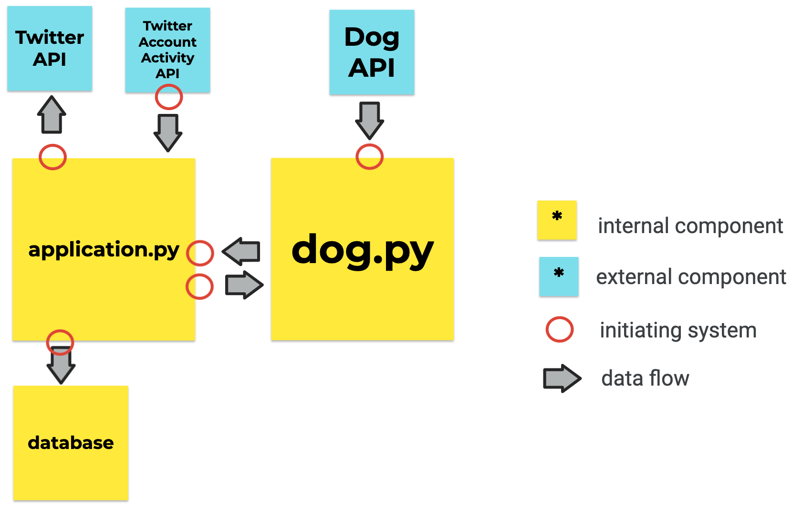

# Twitter @TakeADogBreak DogBot
#### Video demo: https://youtu.be/dTJgkxtVZkw
#### Description:

DogBot is a Twitter bot that tweets photos of dogs to followers of @TakeADogBreak every monday.  Followers indicate their breed preference via DM to @TakeADogBreak, which sends a series of automated messages, handles breed names from the user, and ultimately passes names to be stored in a DB. 

DogBot is a flask pythhon application hosted on heroku. It uses the Tweepy module, a wrapper for the Twitter API, to make API calls to Twitter to send Tweets and DMs, and the Twitter Account Activity API (a separate webhook-based API) to recieve events in real time like follows and dms from Twitter. DogBot uses a postgres DB to stores followers and their dog breed preferences, and sqlalchemy to interact with the DB.  DogBot uses the public free [Dog API](https://dog.ceo/dog-api/) as its source of dog breeds and photos.

## High level structure:

### Main DogBot code
**application.py** - The core program, application.py contains the main code for DogBot. It contains a series of functions that comprise the fuctionality of DogBot, list to the Account Activity API, and call the Twitter API.

**dog.py** - dog.py contains the specific code for making calls to the dog API and handling user input about dog breeds. 

These  will be described in depth.  The dogbot systems interact as follows:

### Hosting DogBot on heroku:
**requirements.txt** - tells heroku what modules & libraries are needed to run dogbot

**Procfile** - tells heroku that dogbot requires a web server, is executed on startup 

### Setting up Twitter Account Activity API webhooks:
**configure_application.py** and **stream_events_application.py** - I used the https://github.com/twitivity/twitivity module to configure my app to use the Twitter Account Activity API.  This included registering a URL for webhooks (the URL is used to recieve events from Twitter, and to handle a twitter security check - https://developer.twitter.com/en/docs/twitter-api/premium/account-activity-api/guides/securing-webhooks), as well as to subscribe to events for my specific Twitter account - @TakeADogBreak.  I ran these two scripts in parallel once to perform webhook registration and subscription.

### Other:
**gitignore** - includes a list of files and directories for git to ignore. The notable files in gitignore include **bot-env**, a virtual environment containing all the modules needed to run DogBot, **/testing**, which includes sample jsons and scripts I used to test DogBot along the way.

**dbsyntax.txt** - includes the commands I used to create tables in my postgres db

## DogBot 

Dog Bot has two main pieces of functionality: **(1) handle follower dog breeds** and **(2) send dog photos to followers**. Prior to discussing these, it is worth noting the configuration required to setup the app in application.py. This includes Twitter Authentication (env variables to hold keys, authentication for the Twitter API), DB set up (defining DB table models, establishing db connection), and Scheduler set up (configuring time zone, starting the scheduler).

### (1) handle follower dog breeds

#### application.py

Handling followers starts with defining routes that listen to incoming events from the Twitter API. The webhooks() function at route /webhooks/twitter handles Twitter's security check, which is a 'GET' request, by returning a token that validates the app and account ownership to Twitter. It also handles events like follows and dms coming in as 'POST' requests by calling event_parse().  event_parse() looks for the events that dogbot cares about - follows and DMs with and without quickreplies - and handles them accordingly:

    Follows: new_followers() is triggered by a follow event, and sends followers through a 'new follower flow' in intro_dm().  This includes storing their user id in a DB, and kicking off a DM conversation to get their preferred dog breed.  intro_dm() function completes with DogBot asking the user if they want to see a specific dog or all dogs, and the user selects an option via quick replies (a Twitter feature that allows a user to select a preset response in a DM).

    DMs with quick replies: When dogbot recieves DMs from followers, event_parse() validates whether the DM included a quick reply, and then calls either quick_reply_handler() or dm_handler(). quick_reply_handler() sends a DM to the user based on the option they chose from a set of options presented by DogBot, as stored in the metadata of the DM object - either prompting them to specify a dog breed, or confirming their choice to see all breeds.

    DMs without quick replies: dm_handler() handles any dm that didn't have a quick reply option, which is (hopefully) a dog breed provided by the user. dm_handler() calls dog(), in dog.py, to do the bulk of the dog breed validation on the input, and ultimately sends a DM to the follower that (1) confirms the chosen dog breed to the follower in a DM, (2) DMs the follower a set of subbreeds to choose from as quick replies if the dog breed was a close match - not an exact match - to multiple breed names or (3) DMs the user that they will get all dog breeds if DogBot did not determine the followers' DM to be a breed/ close to a breed. dm_handler() also stores the chosen dog breed in the db to send dog breed tweets to the user in the future.

#### dog.py

dog() is the main function in dog.py that handles dog breed name input from dm_handler() in application.py().  dog() first standardizes the input (e.g remove whitespace, lowercase).  Then, it calls the dog API for a list of all dog breeds, which are organized by subbreed, and standardizes these names using the same convention.  The breeds are storing as a map in breed_list().  Then, breed_handle() compares the standardized user input value with the map, performing a few string manipulations to look for incomplete breed name, and returns a list of possible dog breeds based on match to dm_handler().  If there is an exact match, there is only one item in the list - if there is a partial match to one or more breeds, it returns them in the list.

### (2) send dog photos to followers

#### application.py

@tweet_followers() sends dog photos to followers every monday at a set time, using a scheduler task with a cron trigger from the APScheduler library. The function triggers at the time specified by the cron trigger within the task.  If triggered, it validates a follower's status as a follower by comparing db followers to twitter followers from the API, deleting db followers if they are not found in the API.  For remaining followers, it fetches the followers' preferred breeds from the db, calls pic_file() from dog.py to get a random picture of that dog breed, then sends a tweet with the dog to the user.

#### dog.py

pic_file() takes the dog breed from the db, and returns a file with the dog pic to application.py.  pic_file() compares the db dog breed to the breed map from breed_list().  When it finds a match, it formats a url with the breed name, which may have one of 3 different formats depending on whether there is a sub breed or not, or if the user gets all breeds.

Once the url is formatted correctly, pic_file calls the dog api, downloads the picture (twitter requires images as files - not urls), then return the image to aplication.py tweet_followers().

## design decisions & trade offs:
1. Separate scripts for dog api calls in dog.py

I chose to separate any functions concerning calls to the dog API in dog.py to make testing easier.  This ended up being helpful to isolate issues, given string manipulation and JSON file handling was error prone.

2. Twitter API vs Twitter Account Activity API 

I initially wrote dog bot entirely using the Twitter API.  However, this resulted in a poor user experience -- instead of getting immediate follows and DMs, all my scripts sent periodic API calls to fetch the newest DMs and follows.  Because of the API rate limits (15 calls per 15 minutes per user), and the sizable delay between when a message is sent and when it can be retrieved from the api (~30-60 seconds), I had to make my program pause a lot, which resulted in a very slow DM conversation with the user.  After I was done, I chose to switch the DM-based features to use the Account Activity API, resulting in an improved experience.